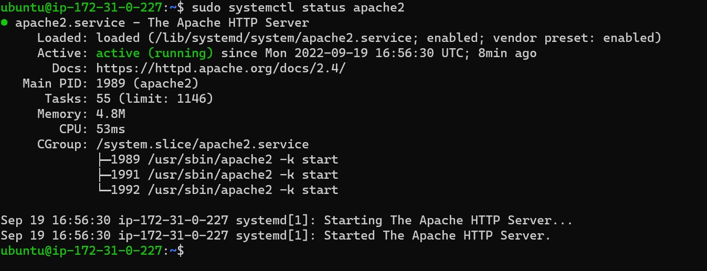
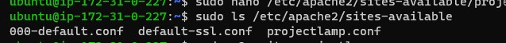

# Documentation for Project 1 (LAMP Stack)
## Step 1 (Installing,Updating and firewall for Apache)

**Update and Install Apache using Ubuntu’s package manager**

- `sudo apt update`

- `sudo apt install apache2`

 **To verify that Apache is running** 
- `sudo systemctl status apache2`

**Security Group before configuring HTTP on port 80** 

**Security Group after configuring HTTP on port 80**

**To verify that our server is running on port 80, run the following commands on the server and on a browser**

(on the server) 
-  curl http://localhost:80

(on the Browser, using the server IP Address)
- http://35.92.171.85:80

## Step 2 (Installing MySQL)
### Use 'apt' to get and install the software 
- `sudo apt install mysql-server`

(When prompted, confirm installation by typing Y, and then ENTER.When the installation is finished, log in to the MySQL console by typing:)

(It’s recommended that you run a security script that comes pre-installed with MySQL. This script will remove some insecure default settings and lock down access to your database system. Before running the script you will set a password for the root user, using mysql_native_password as default authentication method. We’re defining this user’s password as PassWord.1.)

- `ALTER USER 'root'@'localhost' IDENTIFIED WITH mysql_native_password BY 'PassWord.1';`

Exit the MySQL shell with the following command on the MySQL Prompt:

- `exit`

Start the interactive script by running
- `$ sudo mysql_secure_installation`

This will ask if you want to configure the VALIDATE PASSWORD PLUGIN.

Note: Enabling this feature is something of a judgment call. If enabled, passwords which don’t match the specified criteria will be rejected by MySQL with an error. It is safe to leave validation disabled, but you should always use strong, unique passwords for database credentials.

Answer Y for yes, or anything else to continue without enabling.

For the rest of the questions, press Y and hit the ENTER key at each prompt. This will prompt you to change the root password, remove some anonymous users and the test database, disable remote root logins, and load these new rules so that MySQL immediately respects the changes you have made.

When you’re finished, test if you’re able to log in to the MySQL console by typing:

- `sudo mysql -p`

Notice the -p flag in this command, which will prompt you for the password used after changing the root user password.

To exit the MySQL console, type:

- `exit`

## Step 3 (Installing PHP)
You have Apache installed to serve your content and MySQL installed to store and manage your data. PHP is the component of our setup that will process code to display dynamic content to the end user. In addition to the php package, you’ll need php-mysql, a PHP module that allows PHP to communicate with MySQL-based databases. You’ll also need libapache2-mod-php to enable Apache to handle PHP files. Core PHP packages will automatically be installed as dependencies.

- `sudo apt install php libapache2-mod-php php-mysql`

Once the installation is finished, you can run the following command to confirm your PHP version:

- `php -v`

At this point, your LAMP stack is completely installed and fully operational.

## Step 4 (CREATING A VIRTUAL HOST FOR YOUR WEBSITE USING APACHE)

In this project, I configured a domain called **projectlamp,** but you can replace this with any domain of your choice.

Apache on Ubuntu 20.04 has one server block enabled by default that is configured to serve documents from the /var/www/html directory.
We will leave this configuration as is and will add our own directory next next to the default one.

Create the directory for projectlamp using **‘mkdir’** command as follows:

- `sudo mkdir /var/www/projectlamp`

Next, assign ownership of the directory with your current system user:

- `sudo chown -R $USER:$USER /var/www/projectlamp`

Then, create and open a new configuration file in Apache’s sites-available directory using your preferred command-line editor. Here, I used nano

- `sudo nano /etc/apache2/sites-available/projectlamp.conf`

This will create a new blank file. Paste in the following bare-bones configuration by hitting on i on the keyboard to enter the insert mode, and paste the text:

<VirtualHost *:80>
    ServerName projectlamp
    ServerAlias www.projectlamp 
    ServerAdmin webmaster@localhost
    DocumentRoot /var/www/projectlamp
    ErrorLog ${APACHE_LOG_DIR}/error.log
    CustomLog ${APACHE_LOG_DIR}/access.log combined
</VirtualHost>

To save use **ctrl+x** and then Enter Y to save and then press Enter

You can use the **ls** command to show the new file in the sites-available directory

- `sudo ls /etc/apache2/sites-available`

You will see something like this;

With this VirtualHost configuration, we’re telling Apache to serve projectlamp using /var/www/projectlampl as its web root directory. If you would like to test Apache without a domain name, you can remove or comment out the options ServerName and ServerAlias by adding a # character in the beginning of each option’s lines. Adding the # character there will tell the program to skip processing the instructions on those lines.

You can now use a2ensite command to enable the new virtual host:

- `sudo a2ensite projectlamp`

You might want to disable the default website that comes installed with Apache. This is required if you’re not using a custom domain name, because in this case Apache’s default configuration would overwrite your virtual host. To disable Apache’s default website use a2dissite command , type:

- `sudo a2dissite 000-default`

To make sure your configuration file doesn’t contain syntax errors, run:

- `sudo apache2ctl configtest`

Finally, reload Apache so these changes take effect:
- `sudo systemctl reload apache2`

Your new website is now active, but the web root /var/www/projectlamp is still empty. Create an index.html file in that location so that we can test that the virtual host works as expected:

- `sudo echo 'Hello LAMP from hostname' $(curl -s http://169.254.169.254/latest/meta-data/public-hostname) 'with public IP' $(curl -s http://169.254.169.254/latest/meta-data/public-ipv4) > /var/www/projectlamp/index.html`

Now go to your browser and try to open your website URL using IP address:

- `http://35.92.171.85:80`
 

## Step 5 (Enabling PHP on the Website)

With the default DirectoryIndex settings on Apache, a file named **index.html** will always take precedence over an **index.php**. This is useful for setting up maintenance pages in PHP applications, by creating a temporary **index.html** file containing an informative message to visitors. Because this page will take precedence over the **index.php** page, it will then become the landing page for the application. Once maintenance is over, the **index.html** is renamed or removed from the document root, bringing back the regular application page.

In case you want to change this behavior, you’ll need to edit the **/etc/apache2/mods-enabled/dir.conf file** and change the order in which the **index.php** file is listed within the **DirectoryIndex** directive:

- `sudo nano /etc/apache2/mods-enabled/dir.conf`

After saving and closing the file, you will need to reload Apache so the changes take effect:

- `sudo systemctl reload apache2`

Finally, we will create a PHP script to test that PHP is correctly installed and configured on your server.

Now that you have a custom location to host your website’s files and folders, we’ll create a PHP test script to confirm that Apache is able to handle and process requests for PHP files.

Create a new file named **index.php** inside your custom web root folder:

- `nano /var/www/projectlamp/index.php`
  and enter the following text

 `<?php

  phpinfo();

Then Refresh the broswer with the following Ip address 
http://35.92.171.85:80
 
 and you would see the image below 
 

 This page provides information about your server from the perspective of PHP. It is useful for debugging and to ensure that your settings are being applied correctly.

If you can see this page in your browser, then your PHP installation is working as expected.

After checking the relevant information about your PHP server through that page, it’s best to remove the file you created as it contains sensitive information about your PHP environment -and your Ubuntu server. You can use rm to do so:

- `sudo rm /var/www/projectlamp/index.php`

You can always recreate this page if you need to access the information again later.